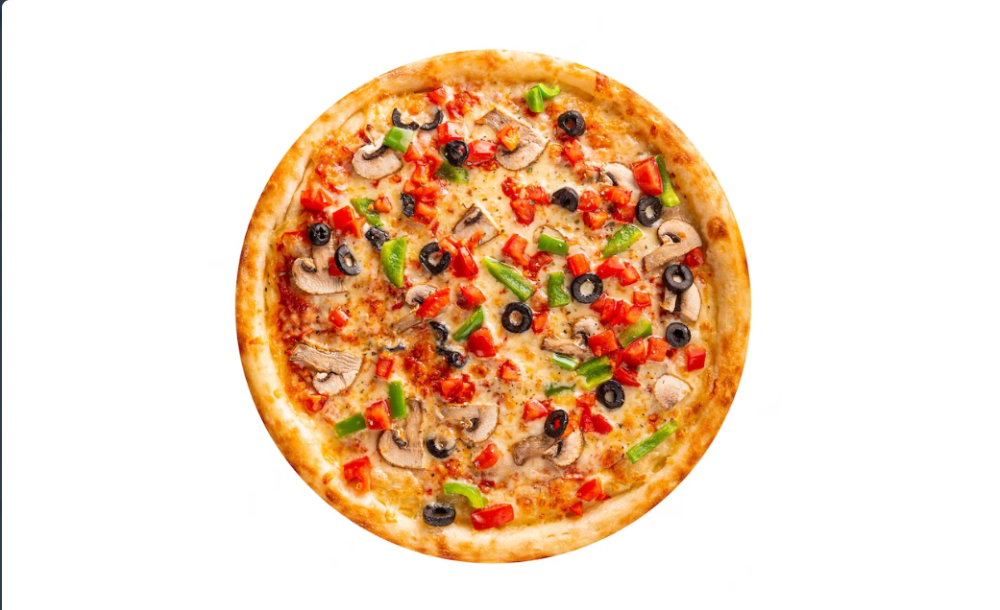

# Plato-s-Pizza-Sales-Analysis

## Introduction
This is a Power BI project on sales analysis of a restaurant called **Plato's Pizza**. 
The project is to analyze the collected data and derive insights for the improvement of their operations.

**_Disclaimer_**: _All datasets and reports do not represent any company, institution or country, but just a dummy dataset to demonstrate Power BI capabilities._

## Problem statement
1. What days and times do we tend to be busiest?
2. What are our best and worst selling pizza?
3. What is our average order value?
4. How much money did we make this year? Can we identify any seasonality in the sales?

## Skills/ concepts Demonstrated
The following Power BI features were incorporated
- Power query
- Page navigation
- Modelling
- Filters

## Modelling

