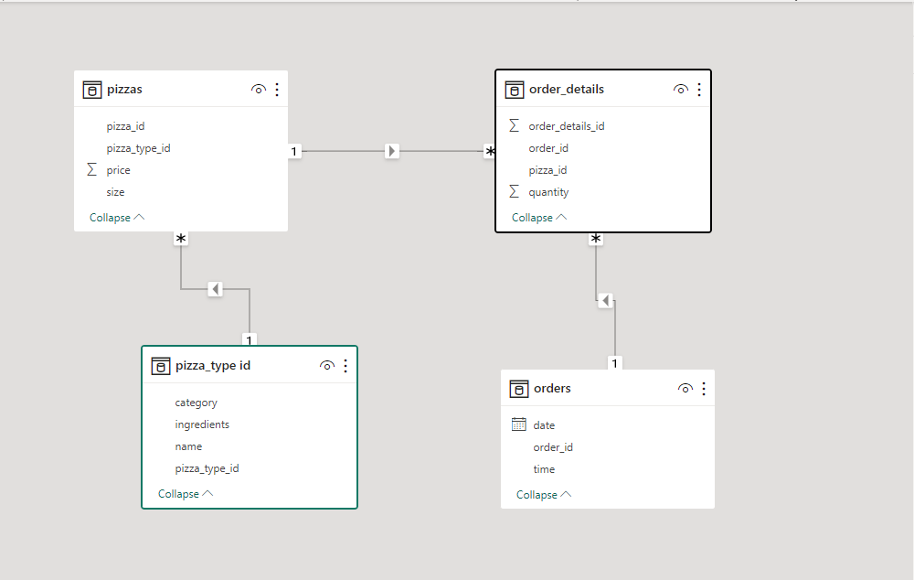
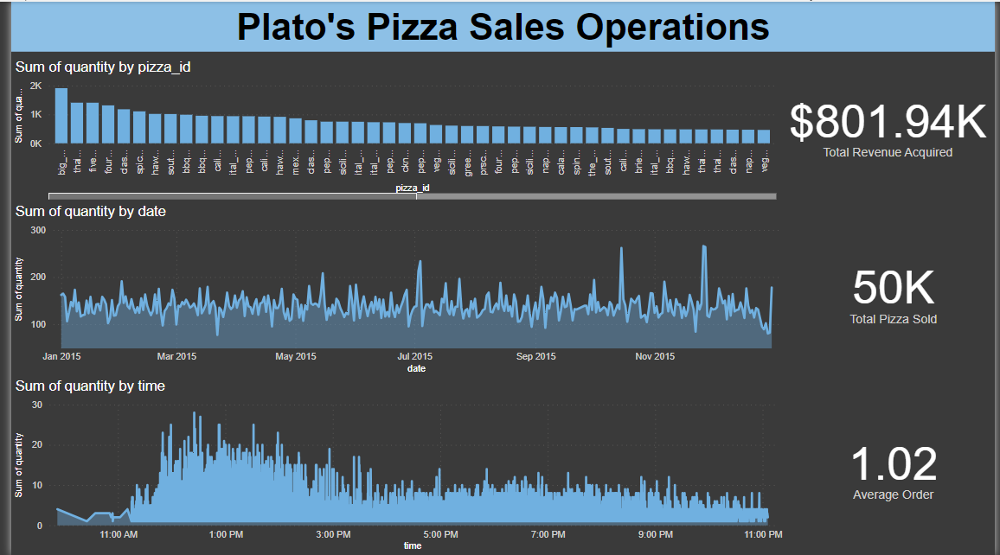

# Plato-s-Pizza-Sales-Analysis

## Introduction
This is a Power BI project on sales analysis of a restaurant called **Plato's Pizza**. 
The project is to analyze the collected data and derive insights for the improvement of their operations.

**_Disclaimer_**: _All datasets and reports do not represent any company, institution or country, but just a dummy dataset to demonstrate Power BI capabilities._

## Problem statement
1. What days and times do we tend to be busiest?
2. What are our best and worst selling pizza?
3. What is our average order value?
4. How much money did we make this year? Can we identify any seasonality in the sales?

## Skills/ concepts Demonstrated
The following Power BI features were incorporated
- Power query
- Page navigation
- Modelling
- Filters

## Modelling

The model is a star schema.
There are 4-dimensional tables joined with a many-to-one relationship.

## Visualization
The report comprises of a page.
You can interact with the report here.

## Analysis

### Order history
The restaurant had a total of 48620 customers.
50000 pizzas were sold in the current year.
The average order value is 1.02

### Product catalog
The restaurant deals with 96 different pizza_id.
Big_meat_s is the best selling pizza while the_greek_xxl is the worse selling pizza.

### Transaction History
The total revenue obtained in the current year is $801.94k.
The busiest days are thursday through sundays.
The busiest times are from 11am to 4pm.
There was no seasonality discovered.

## Conclusion/Recommendation
To improve sales of the poor selling pizzas, proper marketing strategy should be applied.
The quality of the best selling pizza should be maintained to prevent reduced sales.
Workers should be available during the busiest days and times to offer quality services.

